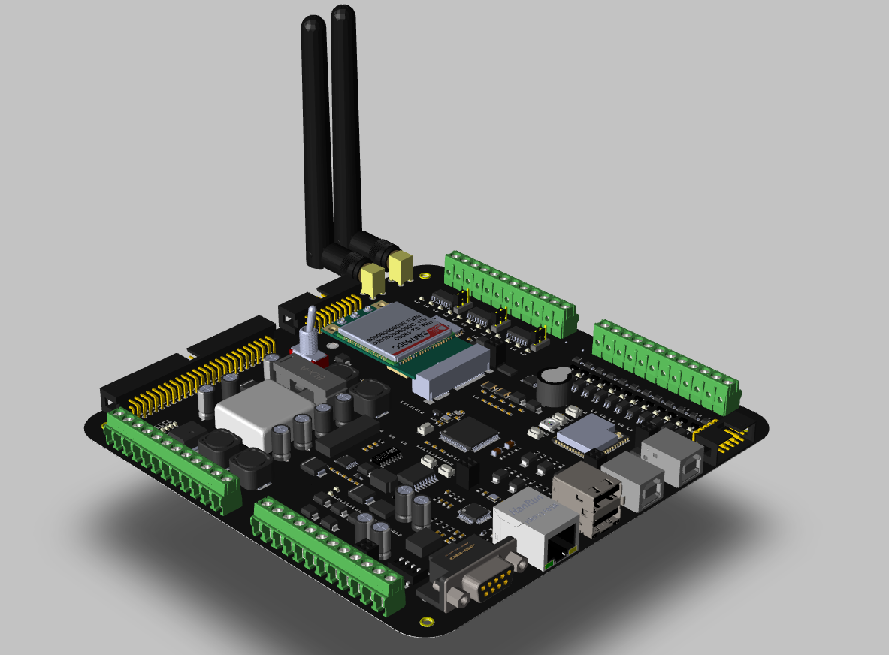
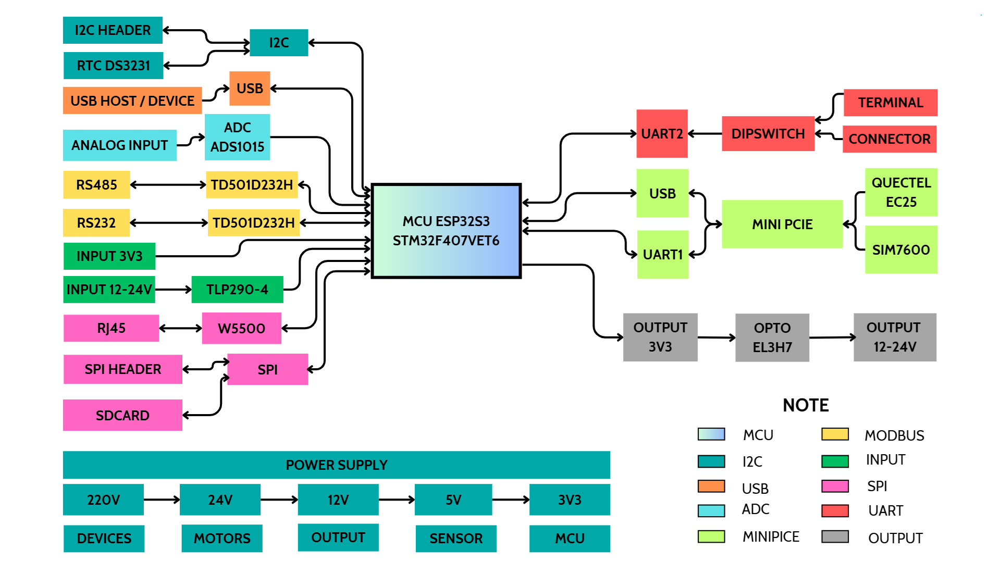
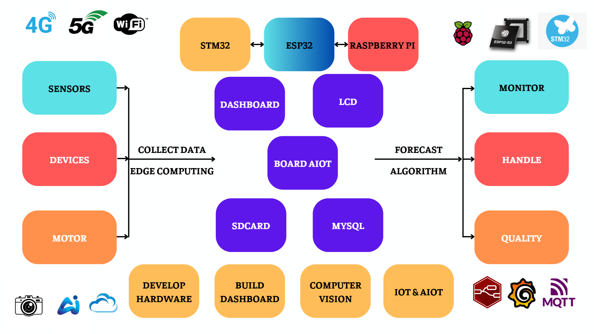

# 4G/5G Board with Orcad/Allegro v17.4
This repository includes visual content, design ideas, PCB layouts, and block diagrams related to the research and development of a 4G MiniPCIe board integrated with a microcontroller. 
> **The project is part of a scientific research study and will be officially reviewed and evaluated by June 2025. Only non-confidential files are provided here for preview.**

## Project Overview
This design is a 6-layer PCB, structured as follows:
- **Layers**: 2 power layers and 4 signal layers
- **Components**: Over 500 components used
- **Software**: Designed using Orcad Allegro v17.4

### Key Files
- **Images**: Includes visual snapshots of the board design and layout.
- **Design Ideas**: Documentation of design concepts and approach.
- **PCB Layouts**: Sample layouts showcasing the design structure.
- **Block Diagrams**: System-level block diagrams for reference.

### Image Display

| View       | Image                   |
|------------|--------------------------|
| Front Left |  |
| Block Diagram |  |
| Idea |  |

### Related Documents
This project interfaces with several key components and modules, detailed below:

1. **Raspberry Pi 4**
   - A versatile single-board computer frequently used for embedded systems.
   - [Datasheet](https://www.raspberrypi.org/documentation/)

2. **STM32F4VET6**
   - A high-performance microcontroller from STMicroelectronics, part of the STM32 family.
   - [Datasheet](https://www.st.com/en/microcontrollers-microprocessors/stm32f4-series.html)

3. **STM32S3**
   - Part of the STM32 series, designed for advanced digital applications.
   - [Datasheet](https://www.st.com/en/microcontrollers-microprocessors/stm32g0-series.html)

4. **SIM7600G-H**
   - A 4G LTE module supporting global bands, suitable for IoT applications.
   - [Datasheet](https://www.simcom.com/product/SIM7600X-H.html)

5. **Quectel 5G Mini PCIe**
   - A powerful 5G-capable module in a Mini PCIe form factor, ideal for high-speed data applications.
   - [Datasheet](https://www.quectel.com/product/5g-redcap-rg255c-mini-pcie-series/)

> **Note**: Full design files and technical specifications will be uploaded after the successful evaluation and official publication of the research in a scientific journal.

Thank you for your interest. Further updates will be available upon project completion.
## Contact

For any questions or additional support, feel free to reach out:

- **Name**: Mai Xuan Canh
- **University**: Ho Chi Minh City University of Technology (HCMUT)
- **Major**: Control and Automation Engineering
- **LinkedIn**: [Canh Mai's LinkedIn](https://www.linkedin.com/in/maixuancanh2003/)
- **Email**: canhmai.work@gmail.com

---